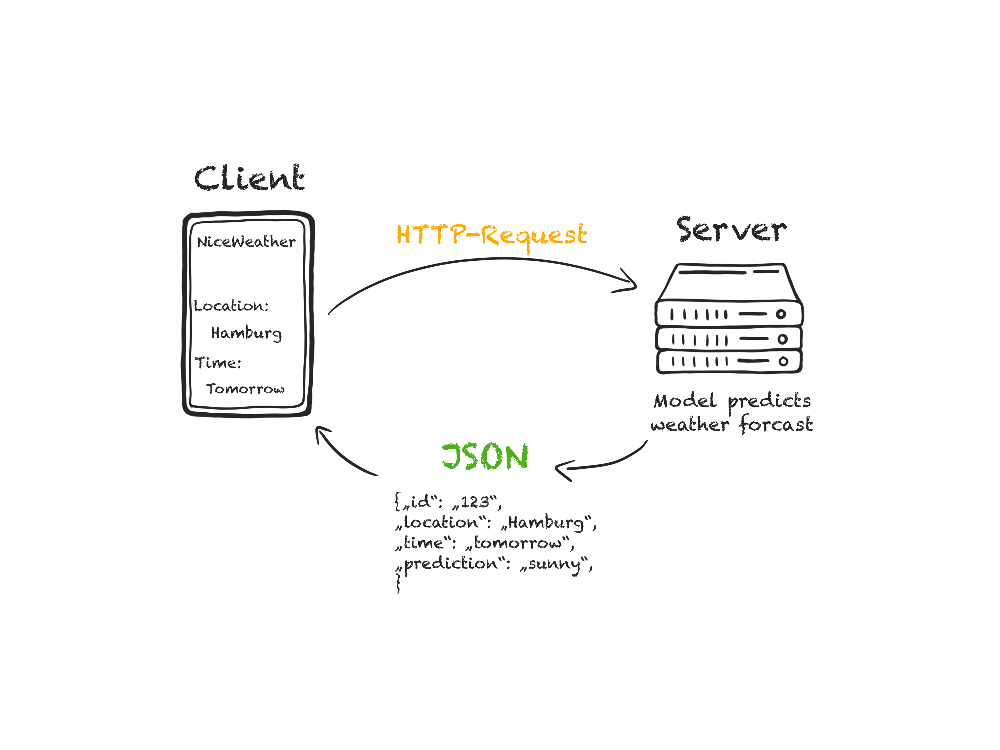

# Deploying a model

## Aim
The aim of this repo is to give you a small introduction into creating an API for deploying a ML model.

## Getting started
Don't clone this repository. It's a template: create your own repository.

One way to deploy a model is to use it as a API endpoint. For example using the [`fastapi`](https://fastapi.tiangolo.com/) framework. Let's start with the question what an API is.

## Application Programming Interface (API)

An application programming interface (API) is a connection between computers or between computer programs. It is a type of software interface, offering a service to other pieces of software. A document or standard that describes how to build such a connection or interface is called an API specification. A computer system that meets this standard is said to implement or expose an API. The term API may refer either to the specification or to the implementation.

In contrast to a user interface, which connects a computer to a person, an application programming interface connects computers or pieces of software to each other. It is not intended to be used directly by a person (the end user) other than a computer programmer who is incorporating it into software. An API is often made up of different parts which act as tools or services that are available to the programmer. A program or a programmer that uses one of these parts is said to call that portion of the API. The calls that make up the API are also known as subroutines, methods, requests, or endpoints. An API specification defines these calls, meaning that it explains how to use or implement them.

One purpose of APIs is to hide the internal details of how a system works, exposing only those parts a programmer will find useful and keeping them consistent even if the internal details later change. An API may be custom-built for a particular pair of systems, or it may be a shared standard allowing interoperability among many systems.

Web APIs allow communication between computers that are joined by the internet. This is the most common meaning of the term API today.

APIs are one of the more common ways technology companies integrate. Those that provide and use APIs are considered as being members of a business ecosystem.




In our case we don't have a Database in the backend but our model.

The main policies for releasing an API are:

- Private: The API is for internal company use only.
- Partner: Only specific business partners can use the API. For example, vehicle for hire companies such as Uber and Lyft allow approved third-party developers to directly order rides from within their apps. This allows the companies to exercise quality control by curating which apps have access to the API, and provides them with an additional revenue stream.
- Public: The API is available for use by the public. For example, Microsoft makes the Windows API public, and Apple releases its API Cocoa, so that software can be written for their platforms. Not all public APIs are generally accessible by everybody. For example, Internet service providers like Cloudflare or Voxility, use RESTful APIs to allow customers and resellers access to their infrastructure information, DDoS stats, network performance or dashboard controls. Access to such APIs is granted either by “API tokens”, or customer status validations.


In the [first notebook](./01_model.ipynb) we created a model, trained it and save it. 

We then can load or model in our API and make prediction how this can be done you can see in ```main.py```.
We use the ['fastapi'](https://fastapi.tiangolo.com/) framework to create the API. You can run the python script or after activating the virtual environment you can run the following command:

> uvicorn main:app --host 0.0.0.0 --port 9696 --reload 

Then you can access the API in your browser under the following url: ```http://0.0.0.0:9696/```

If you want to see the documentation you can go to the following url: ```http://0.0.0.0:9696/docs```

There you can see the documentation of the API and the endpoints. And also try it out in a gui like surface.

If you want to directly target the endpoint you need to use the following url: ```http://0.0.0.0:9696/spam_detection_path/{your message}```

## Setup information

Requirements:
python = 3.11.3 

```bash
pyenv local 3.11.3
python -m venv .venv
source .venv/bin/activate
pip install --upgrade pip
pip install -r requirements_dev.txt
```


There are two requirement files in this template:

- The requirements_dev.txt in this branch, which is the requirements file you can use locally to set everything up and develop the API. You can add as much here as you want to.
- The requirements.txt would be used if you deploy the API. Because Memory for the App is very limited it should not contain the development environment (e.g. jupyter) and as few libraries as possible.
